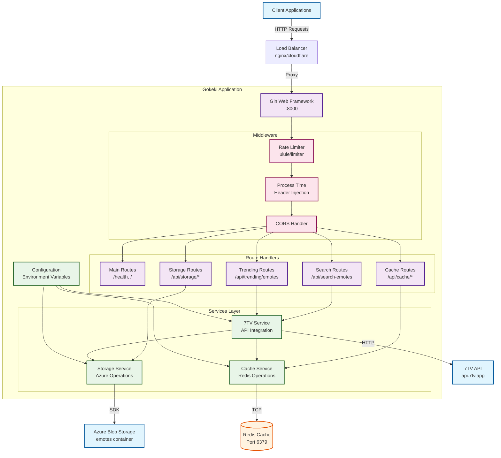
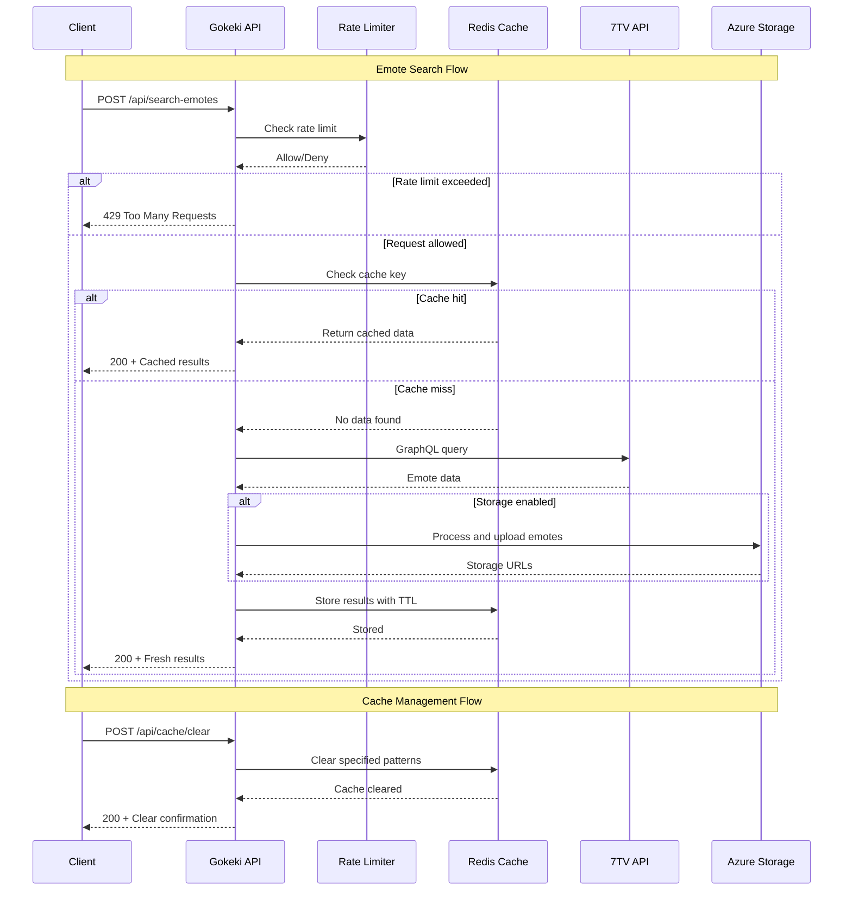
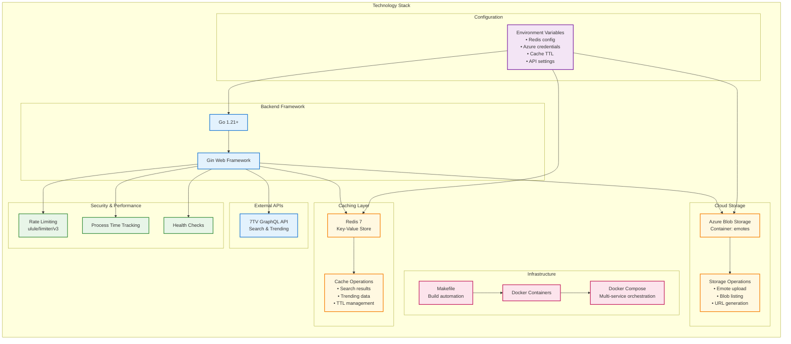

# Gokeki - 7TV Emote API

Una API REST desarrollada en Go para buscar, gestionar y almacenar emotes de 7TV con sistema de caché Redis y almacenamiento en Azure Blob Storage.

## 🚀 Características

- **Búsqueda de emotes**: Busca emotes en la API de 7TV con filtros personalizables
- **Emotes trending**: Obtén los emotes más populares por período (diario, semanal, mensual, all-time)
- **Sistema de caché**: Redis para respuestas rápidas y reducir carga en APIs externas
- **Almacenamiento en la nube**: Sube y gestiona emotes en Azure Blob Storage
- **Rate limiting**: Protección contra abuso con límites por endpoint
- **Health checks**: Monitoreo del estado de la aplicación y Redis
- **Hot reload**: Desarrollo con recarga automática

## 📋 Prerequisitos

- Go 1.21 o superior
- Redis (instalable con Homebrew en Mac o Docker)
- Azure Storage Account (opcional)

## 🛠️ Instalación

### Opción 1: Instalación nativa (macOS con Homebrew)

```bash
# Clonar el repositorio
git clone <tu-repo-url>
cd gokeki

# Instalar Redis
brew install redis
brew services start redis

# Instalar dependencias de Go
go mod download
go mod tidy

# Configurar variables de entorno (opcional)
cp env.example .env
# Editar .env con tus configuraciones

# Ejecutar la aplicación
make run
# o directamente
go run main.go
```

### Opción 2: Con Docker

```bash
# Clonar el repositorio
git clone <tu-repo-url>
cd gokeki

# Levantar Redis
docker-compose up -d redis

# Construir y ejecutar la aplicación
docker build -t gokeki .
docker run -p 8000:8000 --env-file .env gokeki
```

### Opción 3: Setup completo con Make

```bash
# Setup automático (instala dependencias y levanta Redis)
make setup

# Ejecutar aplicación
make run
```

## ⚙️ Configuración

### Variables de entorno requeridas

```bash
# Puerto del servidor (default: 8000)
PORT=8000

# Redis (obligatorio)
REDIS_HOST=localhost
REDIS_PORT=6379
REDIS_DB=0
REDIS_PASSWORD=

# Cache TTL en segundos
CACHE_TTL=3600          # 1 hora para búsquedas
TRENDING_CACHE_TTL=900  # 15 minutos para trending

# Azure Storage (obligatorio para funcionalidad completa)
AZURE_CONNECTION_STRING=DefaultEndpointsProtocol=https;AccountName=tuaccount;AccountKey=tukey;EndpointSuffix=core.windows.net
CONTAINER_NAME=emotes

# Configuración de la API
API_TITLE=7TV Emote API
API_DESCRIPTION=API for fetching and storing 7TV emotes
API_VERSION=1.0.0
```

### Configuración de Azure Storage

Para funcionalidad completa con almacenamiento de emotes:

1. Crea una cuenta de Azure Storage
2. Crea un contenedor llamado `emotes` (o configura `CONTAINER_NAME`)
3. Obtén la connection string desde Azure Portal
4. Configura `AZURE_CONNECTION_STRING` en tu `.env`

## 🏃‍♂️ Uso

### Comandos Make disponibles

```bash
make help          # Ver todos los comandos disponibles
make setup         # Setup completo (instalar deps + levantar Redis)
make run           # Ejecutar la aplicación
make dev           # Modo desarrollo (requiere air)
make build         # Compilar aplicación
make test          # Ejecutar tests
make docker-up     # Levantar Redis con Docker
make docker-down   # Detener Redis
make check-redis   # Verificar conexión a Redis
make clean         # Limpiar archivos compilados
make fmt           # Formatear código
make vet           # Verificar código con go vet
```

## 📖 API Endpoints

La API estará disponible en `http://localhost:8000`

### Información general

| Endpoint | Método | Descripción |
|----------|--------|-------------|
| `/` | GET | Información de la API y endpoints disponibles |
| `/health` | GET | Health check de la aplicación |

### Búsqueda y trending

| Endpoint | Método | Descripción |
|----------|--------|-------------|
| `/api/search-emotes` | POST | Buscar emotes por query |
| `/api/trending/emotes` | GET | Obtener emotes trending |

### Almacenamiento

| Endpoint | Método | Descripción |
|----------|--------|-------------|
| `/api/storage/trending-emotes` | GET | Emotes trending desde Azure Storage |
| `/api/storage/emote-api` | GET | Emotes desde Azure Storage |

### Cache y administración

| Endpoint | Método | Descripción |
|----------|--------|-------------|
| `/api/cache/status` | GET | Estado del sistema de caché |
| `/api/cache/clear` | POST | Limpiar caché |

### Ejemplos de uso

#### Buscar emotes
```bash
curl -X POST http://localhost:8000/api/search-emotes \
  -H "Content-Type: application/json" \
  -d '{
    "query": "pepe",
    "limit": 10,
    "animated_only": false
  }'
```

#### Obtener emotes trending
```bash
# Trending semanal (default)
curl "http://localhost:8000/api/trending/emotes?limit=20"

# Trending mensual
curl "http://localhost:8000/api/trending/emotes?period=trending_monthly&limit=20"

# Solo emotes animados
curl "http://localhost:8000/api/trending/emotes?animated_only=true"
```

#### Estado del sistema
```bash
# Health check
curl http://localhost:8000/health

# Estado del caché
curl http://localhost:8000/api/cache/status

# Limpiar caché específico
curl -X POST "http://localhost:8000/api/cache/clear?cache_type=search"
```

## 🏗️ Arquitectura

### Diagrama de Arquitectura General


```mermaid
graph TB
    %% External Services
    Client[Client Applications]
    SevenTV[7TV API<br/>api.7tv.app]
    Azure[Azure Blob Storage<br/>emotes container]
    
    %% Load Balancer / Reverse Proxy (optional)
    LB[Load Balancer<br/>nginx/cloudflare]
    
    %% Main Application
    subgraph "Gokeki Application"
        direction TB
        
        %% Web Layer
        Gin[Gin Web Framework<br/>:8000]
        
        %% Route Handlers
        subgraph "Route Handlers"
            RouteMain[Main Routes<br/>/health, /]
            RouteAPI[Search Routes<br/>/api/search-emotes]
            RouteTrend[Trending Routes<br/>/api/trending/emotes]
            RouteStorage[Storage Routes<br/>/api/storage/*]
            RouteCache[Cache Routes<br/>/api/cache/*]
        end
        
        %% Services Layer
        subgraph "Services Layer"
            ServiceSTV[7TV Service<br/>API Integration]
            ServiceCache[Cache Service<br/>Redis Operations]
            ServiceStorage[Storage Service<br/>Azure Operations]
        end
        
        %% Middleware
        subgraph "Middleware"
            RateLimit[Rate Limiter<br/>ulule/limiter]
            ProcessTime[Process Time<br/>Header Injection]
            CORS[CORS Handler]
        end
        
        %% Configuration
        Config[Configuration<br/>Environment Variables]
    end
    
    %% External Dependencies
    Redis[(Redis Cache<br/>Port 6379)]
    
    %% Data Flow
    Client -->|HTTP Requests| LB
    LB -->|Proxy| Gin
    
    Gin --> RateLimit
    RateLimit --> ProcessTime
    ProcessTime --> CORS
    CORS --> RouteMain
    CORS --> RouteAPI
    CORS --> RouteTrend
    CORS --> RouteStorage
    CORS --> RouteCache
    
    RouteAPI --> ServiceSTV
    RouteTrend --> ServiceSTV
    RouteStorage --> ServiceStorage
    RouteCache --> ServiceCache
    
    ServiceSTV -->|HTTP| SevenTV
    ServiceStorage -->|SDK| Azure
    ServiceCache -->|TCP| Redis
    
    ServiceSTV --> ServiceStorage
    ServiceSTV --> ServiceCache
    
    Config --> ServiceSTV
    Config --> ServiceCache
    Config --> ServiceStorage
    
    %% Styling
    classDef external fill:#e1f5fe,stroke:#01579b,stroke-width:2px
    classDef app fill:#f3e5f5,stroke:#4a148c,stroke-width:2px
    classDef service fill:#e8f5e8,stroke:#1b5e20,stroke-width:2px
    classDef storage fill:#fff3e0,stroke:#e65100,stroke-width:2px
    classDef middleware fill:#fce4ec,stroke:#880e4f,stroke-width:2px
    
    class Client,SevenTV,Azure external
    class Gin,RouteMain,RouteAPI,RouteTrend,RouteStorage,RouteCache app
    class ServiceSTV,ServiceCache,ServiceStorage,Config service
    class Redis storage
    class RateLimit,ProcessTime,CORS middleware
```

### Flujo de Datos y Operaciones


```mermaid
sequenceDiagram
    participant C as Client
    participant G as Gokeki API
    participant RL as Rate Limiter
    participant Cache as Redis Cache
    participant STV as 7TV API
    participant Azure as Azure Storage
    
    Note over C,Azure: Emote Search Flow
    
    C->>G: POST /api/search-emotes
    G->>RL: Check rate limit
    RL-->>G: Allow/Deny
    
    alt Rate limit exceeded
        G-->>C: 429 Too Many Requests
    else Request allowed
        G->>Cache: Check cache key
        
        alt Cache hit
            Cache-->>G: Return cached data
            G-->>C: 200 + Cached results
        else Cache miss
            Cache-->>G: No data found
            G->>STV: GraphQL query
            STV-->>G: Emote data
            
            alt Storage enabled
                G->>Azure: Process and upload emotes
                Azure-->>G: Storage URLs
            end
            
            G->>Cache: Store results with TTL
            Cache-->>G: Stored
            G-->>C: 200 + Fresh results
        end
    end
    
    Note over C,Azure: Cache Management Flow
    
    C->>G: POST /api/cache/clear
    G->>Cache: Clear specified patterns
    Cache-->>G: Cache cleared
    G-->>C: 200 + Clear confirmation
```

### Stack Tecnológico


```mermaid
graph LR
    subgraph "Technology Stack"
        subgraph "Backend Framework"
            Go[Go 1.21+]
            Gin[Gin Web Framework]
        end
        
        subgraph "External APIs"
            STV[7TV GraphQL API<br/>Search & Trending]
        end
        
        subgraph "Caching Layer"
            Redis[Redis 7<br/>Key-Value Store]
            RedisOps[Cache Operations<br/>• Search results<br/>• Trending data<br/>• TTL management]
        end
        
        subgraph "Cloud Storage"
            Azure[Azure Blob Storage<br/>Container: emotes]
            AzureOps[Storage Operations<br/>• Emote upload<br/>• Blob listing<br/>• URL generation]
        end
        
        subgraph "Security & Performance"
            RateLimit[Rate Limiting<br/>ulule/limiter/v3]
            Metrics[Process Time Tracking]
            Health[Health Checks]
        end
        
        subgraph "Infrastructure"
            Docker[Docker Containers]
            DockerCompose[Docker Compose<br/>Multi-service orchestration]
            Make[Makefile<br/>Build automation]
        end
        
        subgraph "Configuration"
            EnvVars[Environment Variables<br/>• Redis config<br/>• Azure credentials<br/>• Cache TTL<br/>• API settings]
        end
    end
    
    %% Connections
    Go --> Gin
    Gin --> RateLimit
    Gin --> STV
    Gin --> Redis
    Gin --> Azure
    
    Redis --> RedisOps
    Azure --> AzureOps
    
    Gin --> Metrics
    Gin --> Health
    
    Docker --> DockerCompose
    Make --> Docker
    
    EnvVars --> Go
    EnvVars --> Redis
    EnvVars --> Azure
    
    %% Styling
    classDef tech fill:#e3f2fd,stroke:#1976d2,stroke-width:2px
    classDef storage fill:#fff8e1,stroke:#f57c00,stroke-width:2px
    classDef security fill:#e8f5e8,stroke:#388e3c,stroke-width:2px
    classDef infra fill:#fce4ec,stroke:#c2185b,stroke-width:2px
    classDef config fill:#f3e5f5,stroke:#7b1fa2,stroke-width:2px
    
    class Go,Gin,STV tech
    class Redis,RedisOps,Azure,AzureOps storage
    class RateLimit,Metrics,Health security
    class Docker,DockerCompose,Make infra
    class EnvVars config
```

### Características Arquitectónicas

#### **Patrones de Diseño Implementados**
- **Layered Architecture**: Separación clara entre capas web, servicios y datos
- **Repository Pattern**: Abstracción de operaciones de storage y cache
- **Middleware Pattern**: Cross-cutting concerns como rate limiting y métricas
- **Service Pattern**: Servicios especializados para cada responsabilidad

#### **Principios de Escalabilidad**
- **Stateless Design**: Permite escalado horizontal
- **Cache Distribuido**: Redis para alta performance
- **Desacoplamiento**: Servicios independientes y intercambiables
- **Configuración Externa**: Variables de entorno para flexibilidad

#### **Características de Resiliencia**
- **Health Checks**: Monitoreo continuo del estado del sistema
- **Rate Limiting**: Protección contra sobrecarga
- **Graceful Error Handling**: Manejo elegante de fallos
- **Circuit Breaker Pattern**: Protección de servicios externos (implícito)

## 🔧 Desarrollo

### Hot reload con Air

Para desarrollo con recarga automática:

```bash
# Instalar air
go install github.com/cosmtrek/air@latest

# Ejecutar en modo desarrollo
make dev
# o directamente
air
```

### Estructura del proyecto

```
gokeki/
├── main.go              # Punto de entrada
├── config/              # Configuración
├── models/              # Estructuras de datos
├── routes/              # Handlers de rutas
├── services/            # Lógica de negocio
│   ├── cache/          # Gestión de Redis
│   ├── seventv/        # Integración con 7TV API
│   └── storage/        # Gestión de Azure Storage
├── docker-compose.yml   # Redis setup
├── Dockerfile          # Containerización
├── Makefile            # Comandos automatizados
├── .gitignore          # Archivos ignorados
└── README.md           # Esta documentación
```

## 📊 Rate Limits

| Endpoint | Límite |
|----------|--------|
| Search emotes | 100 req/15min |
| Trending emotes | 100 req/15min |
| Storage endpoints | 50 req/15min |
| Cache status | 20 req/1min |
| Cache clear | 5 req/1min |

## 🐳 Docker

### Desarrollo local con Docker

```bash
# Construir imagen
docker build -t gokeki .

# Ejecutar con Redis
docker-compose up -d redis
docker run -p 8000:8000 --env-file .env --network gokeki_default gokeki
```

### Docker Compose completo

```bash
# Levantar toda la stack (Redis + App)
docker-compose up -d
```

## 🐛 Troubleshooting

### Redis no se conecta
```bash
# Verificar que Redis esté corriendo
make check-redis

# Si no está corriendo (Homebrew)
brew services start redis

# Si usas Docker
make docker-up
```

### Error de dependencias
```bash
# Limpiar y reinstalar
go clean -modcache
go mod download
go mod tidy
```

### Azure Storage no disponible
```bash
# La aplicación funcionará sin Azure Storage
# Solo las funciones de storage/upload estarán deshabilitadas
# Verifica la connection string en las variables de entorno
```

### Puertos en uso
```bash
# Cambiar el puerto
export PORT=8080
go run main.go
```

## 🧪 Testing

```bash
# Ejecutar todos los tests
make test

# Ejecutar tests con verbose
go test ./... -v

# Tests de integración
go test ./tests/integration/... -v
```

## 📦 Deployment

### Variables de entorno para producción

```bash
# Obligatorias
REDIS_HOST=your-redis-host
REDIS_PORT=6379
AZURE_CONNECTION_STRING=your-azure-connection-string
CONTAINER_NAME=your-container-name

# Opcionales
PORT=8000
CACHE_TTL=3600
TRENDING_CACHE_TTL=900
```

### Build para producción

```bash
# Compilar para Linux
GOOS=linux GOARCH=amd64 go build -o bin/gokeki-linux main.go

# Compilar para macOS
GOOS=darwin GOARCH=amd64 go build -o bin/gokeki-darwin main.go
```

## 🤝 Contribuir

1. Fork del proyecto
2. Crear rama para feature (`git checkout -b feature/nueva-funcionalidad`)
3. Commit de cambios (`git commit -am 'Agregar nueva funcionalidad'`)
4. Push a la rama (`git push origin feature/nueva-funcionalidad`)
5. Crear Pull Request

## 📄 Licencia

Este proyecto está bajo la licencia MIT. Ver archivo `LICENSE` para más detalles.