# Gokeki - 7TV Emote API

A REST API developed in Go for searching, managing and storing 7TV emotes with Redis caching system and Azure Blob Storage integration.

## 🚀 Features

- **Emote search**: Search emotes on 7TV API with customizable filters
- **Trending emotes**: Get the most popular emotes by period (daily, weekly, monthly, all-time)
- **Cache system**: Redis for fast responses and reduced load on external APIs
- **Cloud storage**: Upload and manage emotes on Azure Blob Storage
- **Rate limiting**: Protection against abuse with limits per endpoint
- **Health checks**: Application and Redis status monitoring
- **Hot reload**: Development with automatic reload

## 📋 Prerequisites

- Go 1.21 or higher
- Redis (installable with Homebrew on Mac or Docker)
- Azure Storage Account (optional)

## 🛠️ Installation

### Option 1: Native installation (macOS with Homebrew)

```bash
# Clone the repository
git clone <your-repo-url>
cd gokeki

# Install Redis
brew install redis
brew services start redis

# Install Go dependencies
go mod download
go mod tidy

# Configure environment variables (optional)
cp env.example .env
# Edit .env with your configurations

# Run the application
make run
# or directly
go run main.go
```

### Option 2: With Docker

```bash
# Clone the repository
git clone <your-repo-url>
cd gokeki

# Start Redis
docker-compose up -d redis

# Build and run the application
docker build -t gokeki .
docker run -p 8000:8000 --env-file .env gokeki
```

### Option 3: Complete setup with Make

```bash
# Automatic setup (install dependencies and start Redis)
make setup

# Run application
make run
```

## ⚙️ Configuration

### Required environment variables

```bash
# Server port (default: 8000)
PORT=8000

# Redis (required)
REDIS_HOST=localhost
REDIS_PORT=6379
REDIS_DB=0
REDIS_PASSWORD=

# Cache TTL in seconds
CACHE_TTL=3600          # 1 hour for searches
TRENDING_CACHE_TTL=900  # 15 minutes for trending

# Azure Storage (required for full functionality)
AZURE_CONNECTION_STRING=DefaultEndpointsProtocol=https;AccountName=youraccount;AccountKey=yourkey;EndpointSuffix=core.windows.net
CONTAINER_NAME=emotes

# API configuration
API_TITLE=7TV Emote API
API_DESCRIPTION=API for fetching and storing 7TV emotes
API_VERSION=1.0.0
```

### Azure Storage configuration

For full functionality with emote storage:

1. Create an Azure Storage account
2. Create a container named `emotes` (or configure `CONTAINER_NAME`)
3. Get the connection string from Azure Portal
4. Configure `AZURE_CONNECTION_STRING` in your `.env`

## 🏃‍♂️ Usage

### Available Make commands

```bash
make help          # See all available commands
make setup         # Complete setup (install deps + start Redis)
make run           # Run the application
make dev           # Development mode (requires air)
make build         # Compile application
make test          # Run tests
make docker-up     # Start Redis with Docker
make docker-down   # Stop Redis
make check-redis   # Verify Redis connection
make clean         # Clean compiled files
make fmt           # Format code
make vet           # Verify code with go vet
```

## 📖 API Endpoints

The API will be available at `http://localhost:8000`

### General information

| Endpoint | Method | Description |
|----------|--------|-------------|
| `/` | GET | API information and available endpoints |
| `/health` | GET | Application health check |

### Search and trending

| Endpoint | Method | Description |
|----------|--------|-------------|
| `/api/search-emotes` | POST | Search emotes by query |
| `/api/trending/emotes` | GET | Get trending emotes |

### Storage

| Endpoint | Method | Description |
|----------|--------|-------------|
| `/api/storage/trending-emotes` | GET | Trending emotes from Azure Storage |
| `/api/storage/emote-api` | GET | Emotes from Azure Storage |

### Cache and administration

| Endpoint | Method | Description |
|----------|--------|-------------|
| `/api/cache/status` | GET | Cache system status |
| `/api/cache/clear` | POST | Clear cache |

### Usage examples

#### Search emotes
```bash
curl -X POST http://localhost:8000/api/search-emotes \
  -H "Content-Type: application/json" \
  -d '{
    "query": "pepe",
    "limit": 10,
    "animated_only": false
  }'
```

#### Get trending emotes
```bash
# Weekly trending (default)
curl "http://localhost:8000/api/trending/emotes?limit=20"

# Monthly trending
curl "http://localhost:8000/api/trending/emotes?period=trending_monthly&limit=20"

# Animated emotes only
curl "http://localhost:8000/api/trending/emotes?animated_only=true"
```

#### System status
```bash
# Health check
curl http://localhost:8000/health

# Cache status
curl http://localhost:8000/api/cache/status

# Clear specific cache
curl -X POST "http://localhost:8000/api/cache/clear?cache_type=search"
```

## 🏗️ Architecture

### General Architecture Diagram


### Data Flow and Operations


### Technology Stack

```mermaid
graph LR
    subgraph "Technology Stack"
        subgraph "Backend Framework"
            Go[Go 1.21+]
            Gin[Gin Web Framework]
        end
        
        subgraph "External APIs"
            STV[7TV GraphQL API<br/>Search & Trending]
        end
        
        subgraph "Caching Layer"
            Redis[Redis 7<br/>Key-Value Store]
            RedisOps[Cache Operations<br/>• Search results<br/>• Trending data<br/>• TTL management]
        end
        
        subgraph "Cloud Storage"
            Azure[Azure Blob Storage<br/>Container: emotes]
            AzureOps[Storage Operations<br/>• Emote upload<br/>• Blob listing<br/>• URL generation]
        end
        
        subgraph "Security & Performance"
            RateLimit[Rate Limiting<br/>ulule/limiter/v3]
            Metrics[Process Time Tracking]
            Health[Health Checks]
        end
        
        subgraph "Infrastructure"
            Docker[Docker Containers]
            DockerCompose[Docker Compose<br/>Multi-service orchestration]
            Make[Makefile<br/>Build automation]
        end
        
        subgraph "Configuration"
            EnvVars[Environment Variables<br/>• Redis config<br/>• Azure credentials<br/>• Cache TTL<br/>• API settings]
        end
    end
    
    %% Connections
    Go --> Gin
    Gin --> RateLimit
    Gin --> STV
    Gin --> Redis
    Gin --> Azure
    
    Redis --> RedisOps
    Azure --> AzureOps
    
    Gin --> Metrics
    Gin --> Health
    
    Docker --> DockerCompose
    Make --> Docker
    
    EnvVars --> Go
    EnvVars --> Redis
    EnvVars --> Azure
    
    %% Styling
    classDef tech fill:#e3f2fd,stroke:#1976d2,stroke-width:2px
    classDef storage fill:#fff8e1,stroke:#f57c00,stroke-width:2px
    classDef security fill:#e8f5e8,stroke:#388e3c,stroke-width:2px
    classDef infra fill:#fce4ec,stroke:#c2185b,stroke-width:2px
    classDef config fill:#f3e5f5,stroke:#7b1fa2,stroke-width:2px
    
    class Go,Gin,STV tech
    class Redis,RedisOps,Azure,AzureOps storage
    class RateLimit,Metrics,Health security
    class Docker,DockerCompose,Make infra
    class EnvVars config
```



### Architectural Characteristics

#### **Implemented Design Patterns**
- **Layered Architecture**: Clear separation between web, services, and data layers
- **Repository Pattern**: Abstraction of storage and cache operations
- **Middleware Pattern**: Cross-cutting concerns like rate limiting and metrics
- **Service Pattern**: Specialized services for each responsibility

#### **Scalability Principles**
- **Stateless Design**: Enables horizontal scaling
- **Distributed Cache**: Redis for high performance
- **Decoupling**: Independent and interchangeable services
- **External Configuration**: Environment variables for flexibility

#### **Resilience Features**
- **Health Checks**: Continuous system status monitoring
- **Rate Limiting**: Protection against overload
- **Graceful Error Handling**: Elegant failure management
- **Circuit Breaker Pattern**: External service protection (implicit)

## 🔧 Development

### Hot reload with Air

For development with automatic reload:

```bash
# Install air
go install github.com/cosmtrek/air@latest

# Run in development mode
make dev
# or directly
air
```

### Project structure

```
gokeki/
├── main.go              # Entry point
├── config/              # Configuration
├── models/              # Data structures
├── routes/              # Route handlers
├── services/            # Business logic
│   ├── cache/          # Redis management
│   ├── seventv/        # 7TV API integration
│   └── storage/        # Azure Storage management
├── docker-compose.yml   # Redis setup
├── Dockerfile          # Containerization
├── Makefile            # Automated commands
├── .gitignore          # Ignored files
└── README.md           # This documentation
```

## 📊 Rate Limits

| Endpoint | Limit |
|----------|--------|
| Search emotes | 100 req/15min |
| Trending emotes | 100 req/15min |
| Storage endpoints | 50 req/15min |
| Cache status | 20 req/1min |
| Cache clear | 5 req/1min |

## 🐳 Docker

### Local development with Docker

```bash
# Build image
docker build -t gokeki .

# Run with Redis
docker-compose up -d redis
docker run -p 8000:8000 --env-file .env --network gokeki_default gokeki
```

### Complete Docker Compose

```bash
# Start entire stack (Redis + App)
docker-compose up -d
```

## 🐛 Troubleshooting

### Redis connection issues
```bash
# Verify Redis is running
make check-redis

# If not running (Homebrew)
brew services start redis

# If using Docker
make docker-up
```

### Dependency errors
```bash
# Clean and reinstall
go clean -modcache
go mod download
go mod tidy
```

### Azure Storage unavailable
```bash
# The application will work without Azure Storage
# Only storage/upload functions will be disabled
# Check connection string in environment variables
```

### Port conflicts
```bash
# Change port
export PORT=8080
go run main.go
```

## 🧪 Testing

```bash
# Run all tests
make test

# Run tests with verbose output
go test ./... -v

# Integration tests
go test ./tests/integration/... -v
```

## 📦 Deployment

### Production environment variables

```bash
# Required
REDIS_HOST=your-redis-host
REDIS_PORT=6379
AZURE_CONNECTION_STRING=your-azure-connection-string
CONTAINER_NAME=your-container-name

# Optional
PORT=8000
CACHE_TTL=3600
TRENDING_CACHE_TTL=900
```

### Production build

```bash
# Compile for Linux
GOOS=linux GOARCH=amd64 go build -o bin/gokeki-linux main.go

# Compile for macOS
GOOS=darwin GOARCH=amd64 go build -o bin/gokeki-darwin main.go
```

## 🤝 Contributing

1. Fork the project
2. Create a feature branch (`git checkout -b feature/new-feature`)
3. Commit your changes (`git commit -am 'Add new feature'`)
4. Push to the branch (`git push origin feature/new-feature`)
5. Create a Pull Request

## 📄 License

This project is under the MIT license. See `LICENSE` file for more details.
